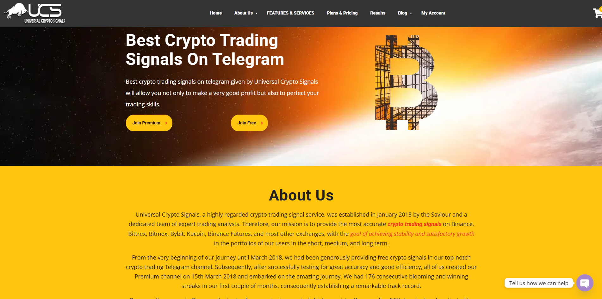

# Universalcryptosignals

**Client:** Universal Crypto Signals  
**Market:** Cryptocurrency Trading Signals  
**Website:** [www.universalcryptosignals.com](https://www.universalcryptosignals.com)
**Location:** Global (Online Service)  
**Technology Stack:** PHP, MySQL, WordPress, WooCommerce, Elementor, Astra Theme, Payment Gateway Integration

---

### 📚 **Overview**

**Universal Crypto Signals** is a leading provider of high-precision cryptocurrency trading signals, founded in January 2018 by a trading expert known as _“The Saviour”_ and a team of seasoned analysts. Their mission is to empower traders across various platforms—**Binance, Bittrex, Bitmex, Bybit, Kucoin, Binance Futures**, and more—with quality signals designed for short-, medium-, and long-term portfolio growth.

---
### 🎯 **Objectives**

- Develop a clean, modern website to reflect the brand’s professionalism and authority in the crypto trading space
    
- Provide an intuitive interface for purchasing signal subscriptions
    
- Ensure secure, seamless user account and payment functionality
    
- Deliver a mobile-optimized experience tailored to on-the-go crypto traders

---
### 🚧 **Challenges**

- **Complex Content Presentation:** Simplifying intricate trading signal data for users of all levels
    
- **Secure Payment Integration:** Enabling safe transactions for subscription services
    
- **User Retention:** Designing an interface engaging for both beginner and advanced traders
    
- **Mobile Optimization:** Ensuring accessibility and performance across mobile devices

---
### 💡 **Our Solution**

We delivered a modern, responsive WordPress website built with **Elementor** and the **Astra Theme**, paired with WooCommerce for subscription handling and seamless payment processing.

**Design & UX Enhancements**

- Developed clean, user-friendly landing pages with CTAs and value-focused content
    
- Used icons, infographics, and concise text to simplify complex trading information
    
- Built a modern visual identity to enhance trust and professionalism

 **Subscription & Payment Integration**

- Integrated **WooCommerce** for managing subscription plans
    
- Connected a **secure payment gateway** to handle transactions safely and reliably
    
- Built a member dashboard for managing subscriptions and accessing crypto signals

 **Content & Signal Distribution**

- Configured a custom **CMS** in WordPress to make content and signal updates easy
    
- Built a dedicated member area with real-time notifications for new signals
    
- Integrated **charts and market analysis tools** to improve trade decision-making

 **Mobile Optimization**

- Fully responsive design ensuring optimal performance on smartphones and tablets
    
- Enabled users to check signals, manage subscriptions, and process payments on the go

 **Security Implementation**

- Deployed **SSL encryption** and standard security protocols
    
- Ensured secure handling of personal and financial data during payment processing

---
### 📈 **Results**

✅ **Enhanced User Experience:** Smooth onboarding from landing to checkout increased user engagement and conversion rates  
✅ **Increased Trust & Credibility:** The site’s professional look and seamless functionality boosted user confidence  
✅ **Scalability for Growth:** The platform was built to evolve, making it easy to expand services and add features  
✅ **Boosted Revenue:** WooCommerce-based subscriptions and easy payments led to higher recurring income

---
### 🙎🏻 **Client Feedback**

> _"Smartscripts helped us reflect our vision and the quality of our services online. Their team understood our technical and business needs, creating a platform that is easy to use, secure, and perfect for our growing user base."_  
> — **Universal Crypto Signals Team**
